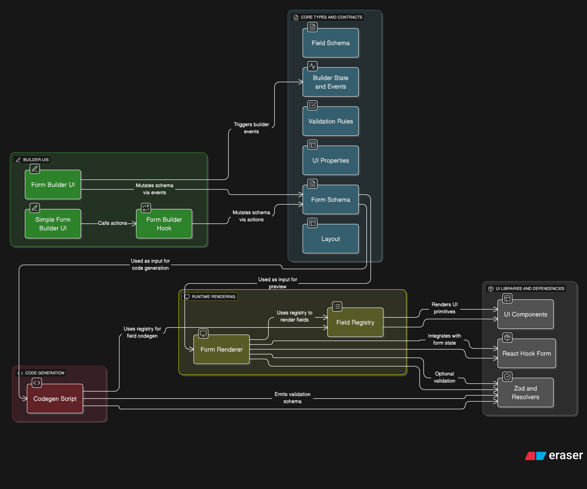

### FormBuilder Architecture

This diagram shows the major modules and their relationships in the formbuilder feature, covering authoring, rendering,
and code generation.

```mermaid
graph TD
  %% Core Types and Contracts
  A[form-schema.ts\n- FormSchema\n- FieldSchema (union)\n- ValidationRules\n- UIProps\n- Layout\n- BuilderState/Events]:::core

  %% Builder UIs
  B[builder/FormBuilder.tsx\n- Local state + events\n- Palette/List/Inspector\n- Preview/Export tabs]:::builder
  C[builder/SimpleFormBuilder.tsx\n- Uses useFormBuilder\n- Same UI primitives]:::builder
  D[hooks/useFormBuilder.ts\n- Debounced schema\n- Actions: add/remove/update\n- selectedField]:::builder

  %% Rendering
  E[renderer/FormRenderer.tsx\n- RHF + optional Zod\n- Layout rendering\n- Registry-driven fields]:::runtime
  F[registry/defaultRegistry.ts\n- FieldRegistry mapping\n- render() impls\n- toTsx() impls\n- fieldTypeInfo]:::runtime

  %% Codegen
  G[codegen/generateFormTsx.ts\n- Collect imports\n- Emit default values\n- Emit Zod schema\n- Emit fields via toTsx\n- Export bundle]:::codegen

  %% Flows
  subgraph Authoring Flow
    B -->|mutates via BuilderEvents| A
    C -->|calls actions| D
    D -->|mutates| A
  end

  subgraph Preview Flow
    A --> E
    E --> F
  end

  subgraph Codegen Flow
    A --> G
    G --> F
  end

  %% UI libs and RHF
  H[@/components/ui/* (shadcn)\nInput/Select/Checkbox/etc.]:::ui
  I[react-hook-form\nregister/Controller]:::dep
  J[zod + @hookform/resolvers]:::dep

  F --> H
  E --> I
  E --> J
  G --> J

  classDef core fill:#eef,stroke:#446,stroke-width:1px
  classDef builder fill:#efe,stroke:#494,stroke-width:1px
  classDef runtime fill:#ffe,stroke:#994,stroke-width:1px
  classDef codegen fill:#fef,stroke:#949,stroke-width:1px
  classDef ui fill:#eef7ff,stroke:#447,stroke-width:1px
  classDef dep fill:#f7f7f7,stroke:#888,stroke-width:1px
```



#### Notes

- `FormRenderer` and `generateFormTsx` both rely on `FieldRegistry` so runtime and generated TSX stay consistent.
- `validation.zod` is a string hint; both renderer and codegen build a Zod schema from field-level metadata and these
  hints.
- Future work (deps/actions) can be implemented inside `FormRenderer` or as a pre-processing step that filters/mutates
  fields before render/codegen.


